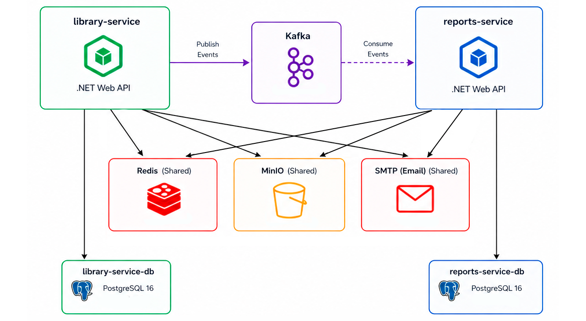

# Общая информация

Система управления библиотекой с отчетностью на базе микросервисов

## Сервисы 

1. **PracticalWork.Library** - сервис управления библиотекой
2. **PracticalWork.Reports** - сервис управления отчетами


## Архитектура 

- **API**: ASP.NET 10  
- **Базы данных**: PostgreSQL  
- **Распределенный кэш**: Redis  
- **Хранение файлов**: MinIO  
- **Межсервисная коммуникация**: Kafka  
- **Планировщик фоновых задач**: Quartz.NET
- **Контейнеризация**: Docker
- **Email-нотификация**: smtp4dev 

## Схема



## Развертывание и конфигурирование приложения

### 1. Клонирование репозитория

```
git clone https://github.com/cl9wnn/AbdtPracticalWork.git
```

### 2. Конфигурация окружения

Для конфигурации приложения заполните файлы  **appsettings.json** в обоих сервисах. Например, для подключения к Redis:
```
 "Redis": {
      "RedisCacheConnection": "localhost:6379", // адрес подключения к Redis
      "RedisCachePrefix": "app:"
    },
```

Пример полной конфигурации сервисов лежит в файле **appsettings.Development.json**.

**Важно!** При запуске через Docker переменные окружения имеют приоритет над значениями из appsettings.json. В **docker-compose.yaml** для каждого сервиса переопределите нужные параметры, например:

```
library-service:
    environment:
      App__Redis__RedisCacheConnection: redis:6379
      App__Minio__Endpoint: minio:9000
```


### 3.1. Запуск через Docker (рекомендуется)

**Важно!** Перед запуском убедитесь, что у Вас имеется установленный **Docker**.

Чтобы легко поднять сервисы вместе со всей инфраструктурой, перейдите в каталог со cклонированным репозиторием и выполните команду:

```
docker-compose up --build
```

После запуска оба сервиса будут готовы к работе. Запросы можно отправлять в браузере (с помощью Swagger), либо через сторонние утилиты (Postman, curl итд).

### 3.2. Локальный запуск

**Важно!** Перед локальным запуском необходимо поднять всю необходимую инфраструктуру системы (2 отдельные PostgreSQL для микросервисов, Redis, MinIO, Kafka, SMTP-сервер) на Вашей машине

Для начала убедитесь, что у Вас имеется необходимая версия .NET SDK 10:

```
dotnet --info
```
Для каждого сервиса выполните команды:

```
dotnet restore
dotnet ef database update
dotnet run
```
После этого сервисы должны запуститься, в терминале каждого появятся логи с адресом, по которому приложение будет доступно. Запросы можно отправлять в браузере (с помощью Swagger), либо через сторонние утилиты (Postman, curl итд).